---

# Workshop Agenda
## Why Baker? (10 minutes)
## Develop an Intuition for Baker (15 m.)
## Implement a Web Shop Flow (25 m.)

---

# Why Baker?

---

## Our Challenge
### Interact with 12 Different Systems (complex environment)
### A Flow of 27 Steps (difficult to reason about the logic)
### From 2 minutes to 6 hours (stateful...)

---

## Requirements
### TIBCO is contained
### Java developers
### State in two data-centres
### Systems fail all the time

---

| Current Account | Savings Account | Customer Onboarding |
| :--- | :---: | ---: |
| Verify Identity | Verify Identity | Verify Identity |
| Register Individual | Register Individual | Register Individual |
| Open *Current* Account | Open *Savings* Account | `n/a` |
| Issue Debit Card | `n/a` | `n/a` |
| Send Message | Send Message | Send Message |
| Register Ownership | Register Ownership | `n/a` |

---

---
## Baker is a Scala Library
### Declare the Logic Like a Recipe
### Visualize the Logic
### Don't Worry About Retries and State
### Re-use What's Already There

---

# Recipes
## Events
## Ingredients
## Interactions

---
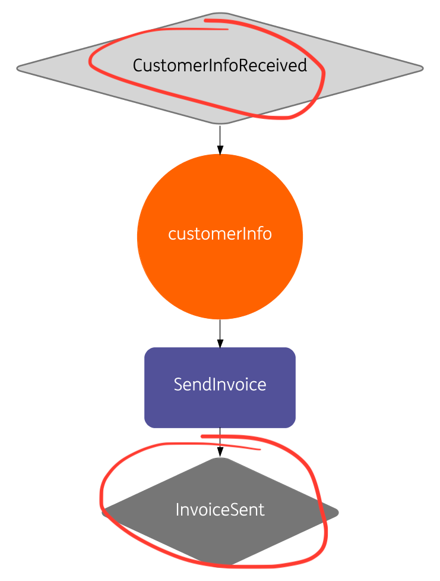
# What is an Event?
## It's what happens
## Sensory and System Events

---
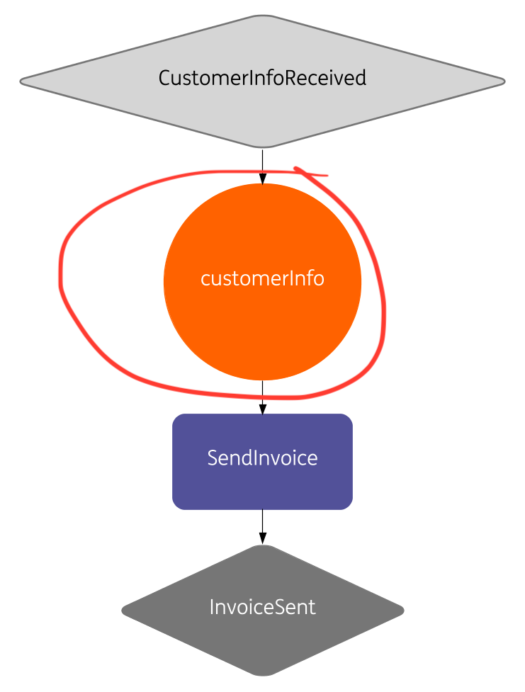
# What is an Ingredient?
## It's a container for data
## Can be a primitive type or a POJO

---
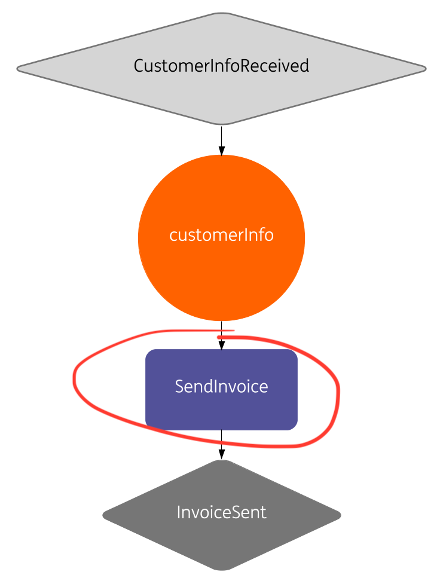
# What is an Interaction?
## It's where you put your system calls
## Capability, not a technical call

---
# Hands-On
## Setup Environment
## Explain the Web-shop Flow
## Exercise, Make Unit-tests Green

---
## Setup Environment
- clone https://github.com/nikolakasev/workshop-baker
- mvn clean test
	- tests fail on purpose
	- do the [exercises](#exercises) to get them green

---
[.background-color: #FFFFFF]
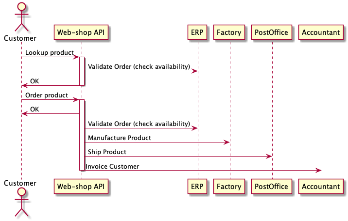

---
[.background-color: #FFFFFF]
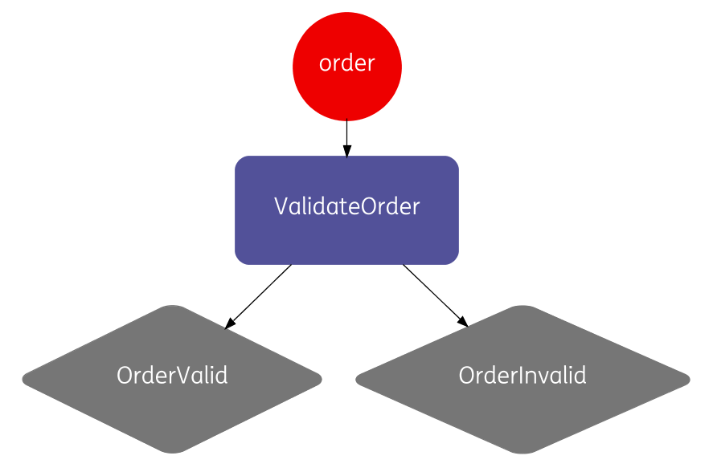

---
[.background-color: #FFFFFF]
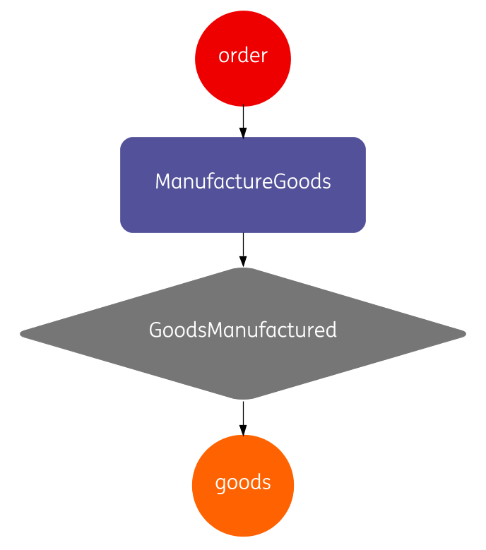

---
[.background-color: #FFFFFF]
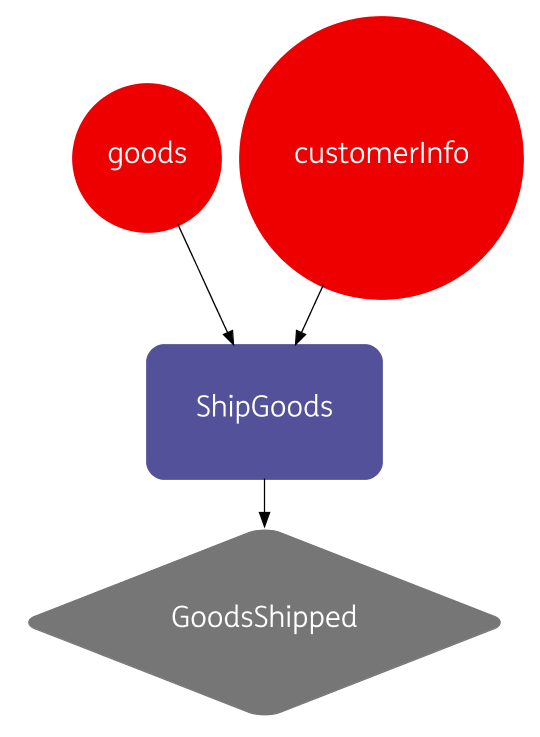

---
[.background-color: #FFFFFF]
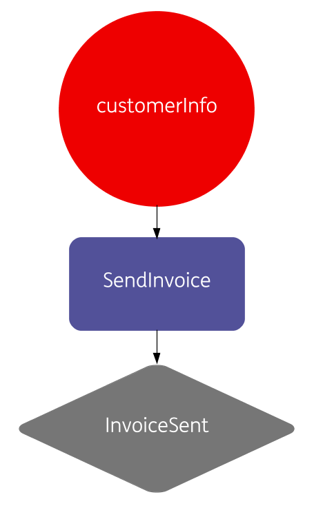

---
<a name="exercises"/>

## Exercises
1. Put all interactions in the recipe
2. Include sensory events in the recipe, use withSensoryEvents()
3. Add extra conditions when an interaction must be executed, use withRequiredEvent()
4. Change the customerInfo class from String to a POJO

---
[.background-color: #FFFFFF]
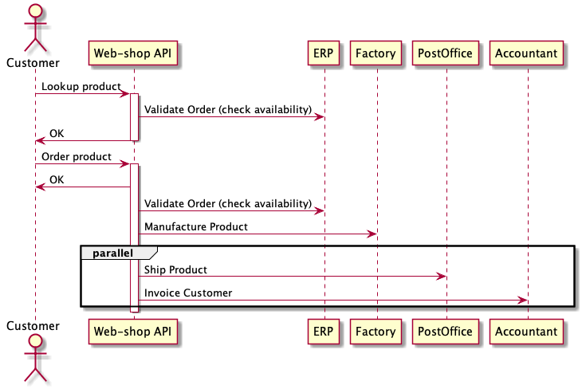

# 5. Call the Postoffice and Accountant Systems in parallel 

---

# What Can Go Wrong?

---
[.background-color: #FFFFFF]
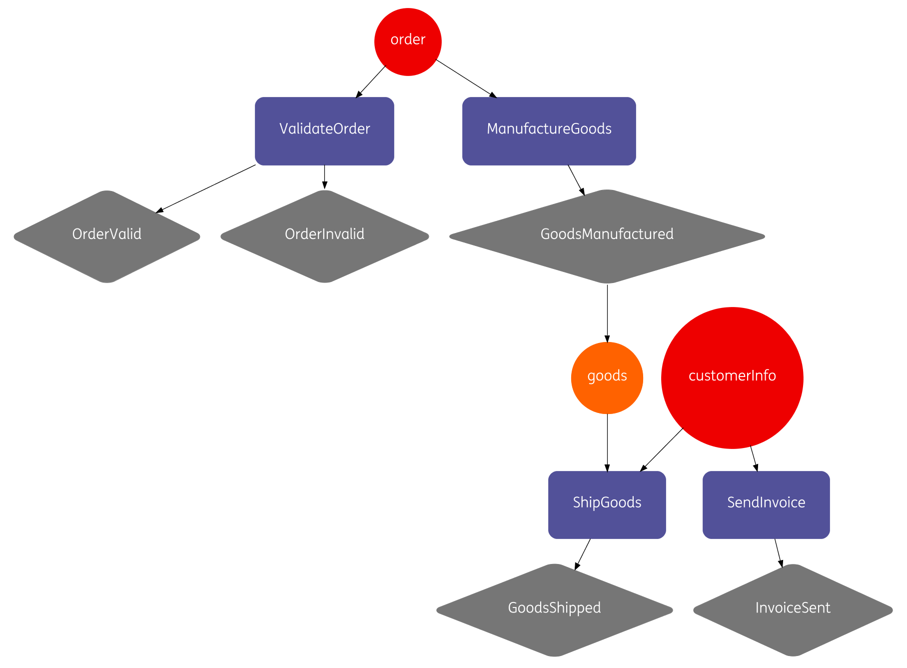

# Recipe has no sensory input, Baker doesn't know where the data comes from

---
[.background-color: #FFFFFF]
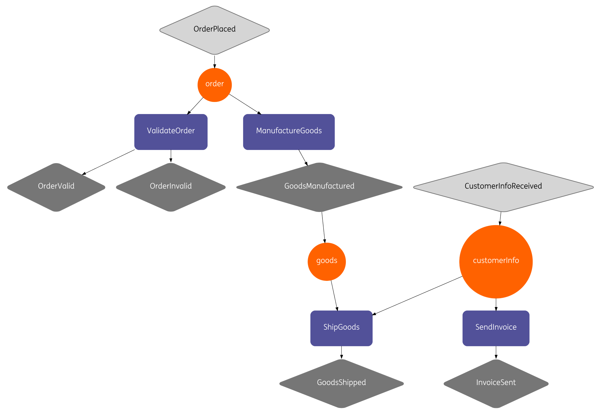

# Which two interactions will be executed when the OrderPlaced event occurs? Is this the desired behavior? 

---
# Desired Recipe

---
[.background-color: #FFFFFF]

---
# Food for Thought
- What to do when the order is invalid?
	- Baker helps developers think about rainy-day scenarios
- What if systems fails, what is desired?
	- See withFailureStrategy(), withDefaultFailureStrategy() methods and InteractionFailureStrategy class

---
# Food for Thought / 2
- How to agree on functionality with stakeholders?
	- Baker represents the Java logic visually
- How to change existing functionality? How to be confident nothing breaks?
	- Baker validates the recipe and reports inconsistencies (such as missing ingredients)

---
# Good to Know

---

## Short-lived vs. long-running flows

---

## State is taken care of:

- Cassandra for persistent storage
- Ingredients encrypted by default
- State recovered automatically
- Configurable Time-to-live

---

## When failure occurs:

- Baker retries technical failures with exponential backoff
	- Any Java Exception thrown is a technical failure
	- Retrying works well with **idempotent** services
- Deal with functional failure in your recipe

---

## Baker Catalogue: Some Stats
### Internal ING library
### 80+ Re-usable Interactions
### 10+ Teams Using Baker

---

## Baker vs. PEGA

| Baker | PEGA |
| :--- | :---: |
| Computer | Computer + Human |
| Focused on APIs | Focused on processes |
| No License Costs | License Costs |
| No Usage Costs | Pay per Case Costs |
| For Java Developers | For PEGA Specialists |
| From ING | From PEGA |

